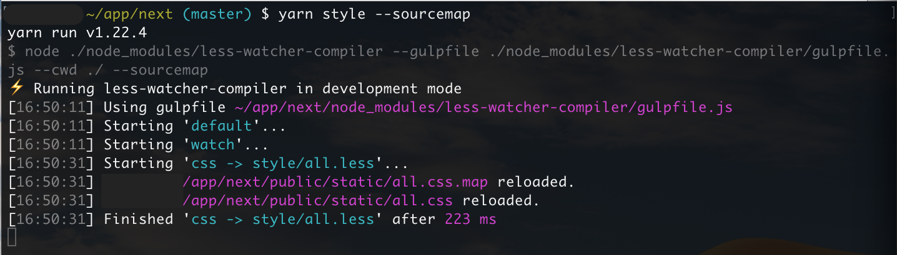

## LESS CSS Watcher + Compiler

1. Watch for file changes and compile less to css. 
2. Customizable lessc options: minify, autoprefixer and flexbugs fixes using PostCSS, etc. (see below).
3. Works when files are added/removed/edited, and watcher updates efficiently. 
4. Resume watching after compilation errors are fixed, without exiting process.
5. Configure multiple source files to watch for changes, and corresponding task to execute.
6. Reload CSS without refreshing app state in browser (using [LiveReload](https://chrome.google.com/webstore/detail/livereload/jnihajbhpnppcggbcgedagnkighmdlei?hl=en) - better and faster than Hot reloading)

### Installation
```
yarn add -D less-watcher-compiler
```

### Options
Create less-watcher-compiler.config.js (optional) in the root directory with this content:
```
module.exports = function (defaultConfig) {
  return {
    ...defaultConfig,
    // Default Options
    files: [ // list of source files to watch for changes and corresponding tasks to run
      {
        task: 'css', // name of the task to run, must be one of ['css', 'copy']
        watch:  [ // file/s to watch for changes, using glob pattern
          'style/**/*.less',
          'style/override/**/*',
          'style/theme.config'
        ],
        compile: 'style/all.less', // file/s to compile when changes detected, using glob pattern
        output: 'public/static/', // destination directory where new file/s should be saved
      },
      {
        task: 'copy', // copy over `compile` file/s to `output` directory without compilation
        watch:  [
          'style/fonts/**/*', // watch for changes of all file types within `style/fonts/` directory
        ],
        compile: 'style/fonts/**/*.{eot,eof,svg,ttf,woff,woff2}', // only copy over files with matched extensions
        output: 'public/static/fonts/',
        renameOptions: {dirname: ''}, // make folder structure flat on output, using `gulp-rename` npm package
      },
    ],
    symlinks: [ // useful for Semantic UI theme.config setup using `semantic-ui-less` library
      {
        // paths are relative to process.cwd()
        target: 'style/theme.config', // path to the source file to reference
        link: 'node_modules/semantic-ui-less/theme.config' // path to the file that references the target
      }
    ],
    minify: false,
    sourcemap: false,
    autoprefix: true,
    flexbugsfix: true,
    browserslist: {
      "production": [
        ">0.3%",
        "not dead",
        "not op_mini all"
      ],
      "development": [
        "last 1 chrome version",
        "last 1 firefox version",
        "last 1 safari version",
        "last 1 ie version"
      ]
    },
    postcssPlugins: [], // additional PostCSS plugins to use (you must install them yourself)
    postcssOptions: undefined, // additional PostCSS options to use (i.e. `{ parser: 'sugarss' }`)
    plugins: [
      'less-plugin-glob',
      'less-plugin-functions',
    ],
    // ...Other options passed to `lessc` compiler (currently using `gulp-less` npm package)
  }
}
```
All options can be passed as command line (cli) arguments, which will override config file options.


### Usage
Add this script to `package.json`:
```
  ...
  "scripts": {
    "style": "node ./node_modules/less-watcher-compiler --gulpfile ./node_modules/less-watcher-compiler/gulpfile.js --cwd ./"
  ...
```

To watch and compile, run:
```
yarn style --sourcemap
```

To compile only once (useful for production build), run:
```
NODE_ENV=production yarn style css
```

To watch and compile with Semantic UI theme.config, run:
```
yarn style watch symlink
```
